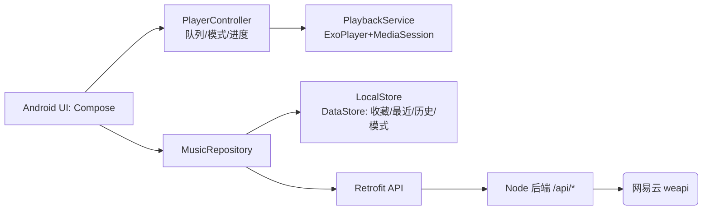

# HH音乐 · 网易云第三方音乐播放器（Android）

一个基于网易云接口的第三方音乐播放器。

> **v1.2 起：App 直连网易云，无需本机后端。** 客户端内置 eapi 加密（移植自 [GuitaristRin/Ncrust](https://github.com/GuitaristRin/Ncrust)），直接访问 `music.163.com`；歌曲地址还有公开「outer url」兜底，连 cookie 都不用登录即可播大量歌曲。`server/` 仅作可选的传统 weapi 代理保留。

```
┌─────────────────┐   eapi加密/直连https    ┌─────────────────┐
│   Android App   │ ───────────────────────▶│  网易云 music.163│
│ Compose/ExoPlayer│◀───────────────────────│                 │
└─────────────────┘                         └─────────────────┘
        (无需本机后端；server/ 为可选)
```

组件：
- `android/` — 原生 Android 客户端（Kotlin + Jetpack Compose + Media3/ExoPlayer），内置 eapi 直连。
- `server/` — Node.js/Express 后端代理（可选，weapi 签名，统一 JSON），历史保留。

## 功能

- 🔍 关键词搜索歌曲 / 歌手
- ▶️ 播放、暂停、上一首 / 下一首、拖动进度
- 📃 播放队列（可点选跳转）
- 🎼 实时滚动歌词（带时间轴 & 翻译）
- 🏆 排行榜 / 歌单浏览与一键播放
- 🎚 通知栏 / MediaSession 控制（锁屏可控）
- 🎨 仿网易云深色绿色主题

## 一、（可选）启动后端代理

> **默认无需启动。** v1.2 起 App 直连网易云。仅当你想用后端走 weapi 代理时，才启动它，并把 `MusicRepository.USE_BACKEND` 改为 `true`。

```bash
cd server
npm install
npm start          # 默认监听 http://localhost:3000
```

健康检查：

```bash
curl http://localhost:3000/api/health
```

可用接口：

| 接口 | 说明 |
|------|------|
| `GET /api/search?s=周杰伦&limit=30` | 搜索歌曲 |
| `GET /api/song/detail?ids=5257138,210049` | 歌曲详情 |
| `GET /api/song/url?id=5257138&level=exhigh` | 获取播放地址（mp3/flac） |
| `GET /api/lyric?id=5257138` | 获取歌词 |
| `GET /api/playlist/detail?id=19723756` | 歌单详情 |
| `GET /api/toplist` | 排行榜列表 |
| `POST /api/song/like`        body `{"id":123,"like":true}` | 喜欢歌曲 |

## 二、运行 Android 客户端（开箱即用，无需后端）

App 直连网易云，装上即用。可选：登录后可播 VIP 曲目 —— 在 `DirectNcmClient.setCookie(\"MUSIC_U=...\")` 注入 cookie。

> 后端方案见第一节（可选）。默认 `MusicRepository.USE_BACKEND=false`。
### 2. 用 Android Studio 打开并运行

1. 打开 Android Studio → `Open` → 选择 `D:\HHmusic\android` 目录。
2. 等待 Gradle 同步下载依赖（首次需要联网，约几分钟）。
3. 选择设备 / 模拟器，点击 ▶️ Run。

> 要求：Android Studio Hedgehog 及以上、JDK 17+、Android SDK API 34。
> 本机已检测到 JDK 21（Corretto），Android SDK 由 Android Studio 提供。

## 技术栈

**后端**：Node.js、Express、网易云 weapi 自实现加密（AES-128-CBC + RSA）。

**客户端**：
- UI：Jetpack Compose、Material 3
- 播放：Media3 / ExoPlayer + MediaSession（前台服务 + 通知栏）
- 网络：Retrofit + kotlinx.serialization + OkHttp
- 图片：Coil
- 架构：单 Activity + Navigation Compose + 手动依赖注入（AppContainer）

## 目录结构

```
D:\HHmusic
├─ server/                     后端代理
│  ├─ src/
│  │  ├─ crypto.js             weapi 加密（AES+RSA）
│  │  ├─ netease.js            网易云接口封装
│  │  └─ index.js              Express 路由（/api/*）
│  └─ package.json
└─ android/                    Android 客户端
   ├─ app/
   │  ├─ build.gradle.kts
   │  └─ src/main/
   │     ├─ AndroidManifest.xml
   │     ├─ res/               主题/图标/字符串
   │     └─ java/com/hh/music/player/
   │        ├─ MainActivity.kt / HHMusicApp.kt
   │        ├─ data/           数据模型 / Repository / AppContainer
   │        ├─ network/        Retrofit API / 网络模块
   │        ├─ playback/       PlaybackService / PlayerController
   │        └─ ui/             搜索 / 播放器 / 歌单 / 主题 / 组件
   ├─ build.gradle.kts
   ├─ settings.gradle.kts
   ├─ gradle.properties
   ├─ gradle/libs.versions.toml
   └─ gradle/wrapper/          Gradle Wrapper
```

## 免责声明

本项目仅供学习交流使用，接口与资源版权归网易云音乐所有。请勿用于商业用途。


## v1.1 新增功能

> 后端已扩展 4 个接口、客户端新增「发现 / 我的」页与本地持久化。

### 新接口（后端 `server/`）

| 接口 | 说明 |
|------|------|
| `GET /api/recommend/songs?limit=30` | 每日推荐 |
| `GET /api/recommend/playlists?limit=12` | 推荐歌单 |
| `GET /api/artist/songs?id=6452&limit=50&order=hot` | 歌手热门歌曲（order=hot/time） |
| `GET /api/new/song?limit=30` | 新歌速递 |

### Android 新功能

- 🧭 **底部导航重构**：发现 / 搜索 / 排行榜 / 我的，四大 Tab 切换
- 🔭 **发现页**：每日推荐 + 新歌速递 + 推荐歌单（卡片网格），一键播放
- ❤️ **我的**：收藏歌曲 / 最近播放 / 收藏歌单，三个子 Tab；最近可清空
- 🔖 **本地持久化**（DataStore）：收藏、最近播放（最多 50）、歌单收藏、播放模式、搜索历史全部本地保存
- 🔁 **播放模式**：顺序播放 / 单曲循环 / 随机播放，循环切换并持久化
- 🕘 **搜索历史**：空态展示历史关键词，点选即搜，可清空
- ❤️ **收藏按钮**：播放页歌曲收藏、歌单详情页收藏歌单
- 🎵 播放/切歌时自动记录到「最近播放」

### 架构图



